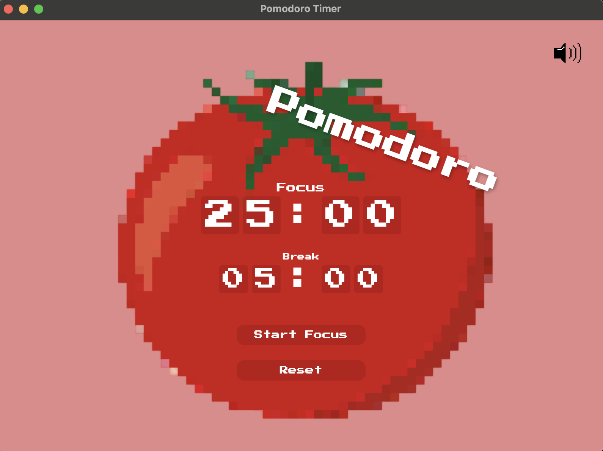

# Pomodoro Timer

A stylish, pixel-art themed Pomodoro timer built with Electron.js. This application helps you manage your work and break sessions with a beautiful retro-gaming aesthetic.



## Features

- 🎯 Focus Timer: Customizable focus session duration
- ☕ Break Timer: Adjustable break periods
- 🎨 Pixel Art Design: Retro-gaming aesthetic with pixel art tomato theme
- 🔊 Sound Notifications: Audio alerts when sessions complete
- 🎮 Retro Font: Uses "Press Start 2P" font for authentic pixel art feel
- 🔄 Session Management: Automatic switching between focus and break periods
- 💾 Time Input: Digital clock-style input boxes for precise time setting

## Installation

1. Clone the repository:
```bash
git clone https://github.com/thomasrigby/PomodoroApp.git
```

2. Navigate to the project directory:
```bash
cd PomodoroApp
```

3. Install dependencies:
```bash
npm install
```

4. Start the application:
```bash
npm start
```

## Usage

1. **Setting Time**
   - Use the digit boxes to set your desired focus and break durations
   - Default focus time is 25:00 minutes
   - Default break time is 05:00 minutes

2. **Controls**
   - Click "Start Focus" to begin a focus session
   - Click "Start Break" to begin a break session
   - Use "Reset" to return to default settings
   - Click the volume icon to toggle sound notifications

3. **Timer States**
   - Focus timer will automatically transition to break timer when complete
   - Break timer will reset to focus timer when complete
   - Visual and audio notifications indicate session completion

## Development

This project is built with:
- Electron.js
- HTML/CSS
- Vanilla JavaScript
- Pixel Art Assets

### Building from Source

To package the application:

```bash
npm run make
```

## License

This project is licensed under the MIT License - see the [LICENSE](LICENSE) file for details.

## Acknowledgments

- Pixel art assets and sound effects used under appropriate licenses
- "Press Start 2P" font from Google Fonts
- Built with Electron Forge

## Contributing

1. Fork the repository
2. Create your feature branch (`git checkout -b feature/AmazingFeature`)
3. Commit your changes (`git commit -m 'Add some AmazingFeature'`)
4. Push to the branch (`git push origin feature/AmazingFeature`)
5. Open a Pull Request 
